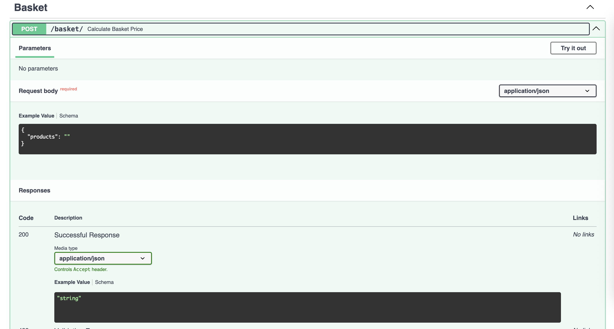
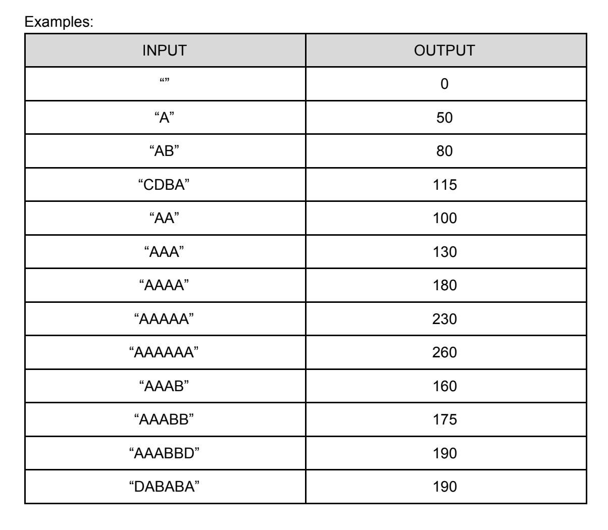
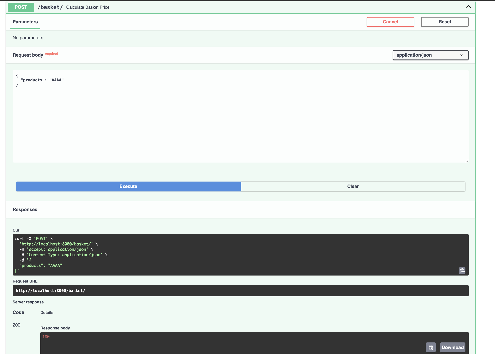

# Fastapi-orders
Conditional offer on product based on count in bucket(user input)

> [!NOTE]  
> - Sqlite DB is used  
> - Present in repository itself
> - More products, conditionalOffer can be added via the `create product`, `Conditions`, `Benefits`.  
> Scope of the functionality can be improved by expending the logic from `Count` refrenced fixed-amount discount to percentage or fixed-amount discount on sub-total of a product in the basket  

### Running container instance of application
- Create docker image of application  

```
> docker build -t orders:v1 .
``` 

> [!TIP]  
> Run the build command in the directory containing the `Dockerfile` or provide the file path using the `-f` argument.  

- Create the application container instance
```
> docker run -d -p 8000:8000 orders:v1 /bin/sh
```

Application instance is will be up and running and can be accessed at
http://localhost:8000/docs

### How to run the application

- Run the following command to create a VirtualEnv  

```
> python3 -m venv .venv
```

- Activate the env

```
> source .venv/bin/activate
```

- Install the dependencies

```
> pip install -r requirements.txt
```

- Run the application via uvicorn server
```
> uvicorn main:app --reload
```

### Steps to validate the functionality

- On any browser open the following url to open FastApi's swagger docs   
http://localhost:8000/docs

- In the basket section use the `Calculate basket price` API to test the functionality.



Click on `Try it out` on top right corner and pass the products strings as mentioned below as the request body.



### Result screen


